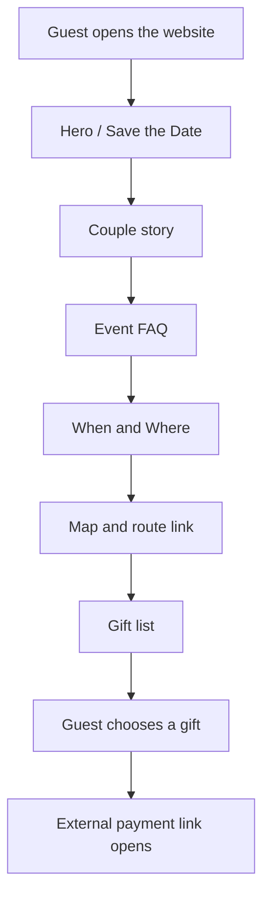
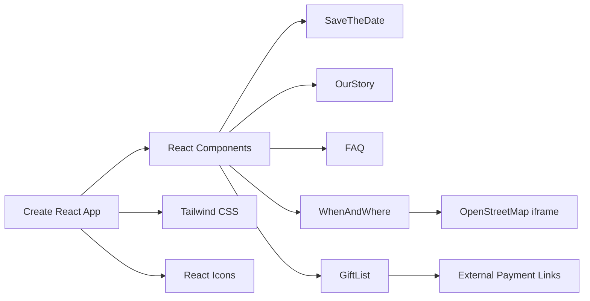

# 💍 Fabiana & Willian Wedding Website

<h3 align="center">
  A romantic and responsive wedding website built with React, Tailwind CSS and custom visual sections.
</h3>

<p align="center">
  <strong>Save the Date · Love Story · Event FAQ · Map · Gift List · Photo Gallery · Responsive Design</strong>
</p>

<p align="center">
  
  
  
  
</p>

---

## 📌 About the Project

**Fabiana & Willian Wedding Website** is a custom wedding landing page created to share the couple’s story, event details, ceremony location, dress code, photo gallery and gift list in a warm and personal digital experience.

The website is designed as a single-page React application with visual sections, romantic typography, responsive layout and direct links for guests to access event information and gift options.

### 🇧🇷 Descrição em Português

O **site de casamento da Fabiana e do Willian** é uma landing page personalizada para apresentar a história do casal, data do casamento, dúvidas do evento, localização da cerimônia, rota no mapa, galeria de fotos e lista de presentes com links externos.

---

## 🎯 Project Goal

The goal of this project is to create a beautiful, practical and shareable wedding website for guests.

Instead of sending event information through multiple messages, the website centralizes everything guests need to know:

- wedding date
- ceremony location
- party location
- event time
- dress code
- couple story
- photo gallery
- gift options
- map and route link

---

## ✨ Features

### Wedding Hero

- Full-screen hero section
- Couple names highlighted
- “Save the Date” message
- Wedding date
- Decorative olive/leaf visual identity

### Love Story

- Personalized story section
- Humorous and emotional narrative
- Individual profile cards for the bride and groom
- Social media buttons
- Couple photo
- Responsive photo gallery

### Event FAQ

- Ceremony location
- Party location
- Date
- Time
- Dress code
- Icon-based question cards
- Background image overlay with blur

### When & Where

- Ceremony details
- Date and time
- Address
- Embedded map
- External Google Maps route link

### Gift List

- Custom gift cards
- Humorous gift titles
- Gift image
- Gift price
- External payment links
- Responsive grid layout

### Visual / UX

- Mobile-friendly layout
- Tailwind utility classes
- Custom fonts
- Wedding color palette
- Image modal behavior on desktop
- Open Graph metadata for social sharing

---

## 🧠 How It Works



---

## 🏗️ Architecture



---

## 🛠️ Tech Stack

| Technology | Usage |
|---|---|
| React 18 | UI components |
| Create React App | Project setup and build scripts |
| Tailwind CSS | Styling and responsive layout |
| React Icons | Wedding/event icons |
| OpenStreetMap iframe | Embedded map |
| Google Fonts | Custom typography |
| CSS | Background image and map container styles |
| Web Vitals | Performance metrics support |

---

## 📁 Project Structure

```bash
fabianaewillian_casamento/
├── public/
│   ├── Casamento-bg.webp
│   ├── FabianaWillian.png
│   ├── ceremony-icon-2.svg
│   ├── img-link.png
│   ├── manifest.json
│   └── ...
├── src/
│   ├── components/
│   │   ├── Buttons.jsx
│   │   ├── FAQ.jsx
│   │   ├── GiftList.jsx
│   │   ├── ImageBox.jsx
│   │   ├── MapsComponent.jsx
│   │   ├── OurStory.jsx
│   │   ├── SaveTheDate.jsx
│   │   └── WhenAndWhere.jsx
│   ├── App.css
│   ├── App.js
│   ├── index.css
│   └── index.js
├── package.json
├── tailwind.config.js
└── README.md
```

---

## 📄 Main Files

| File | Description |
|---|---|
| `src/App.js` | Main page composition and section order |
| `src/components/SaveTheDate.jsx` | Hero section with couple names and wedding date |
| `src/components/OurStory.jsx` | Couple story, profiles, social buttons and gallery |
| `src/components/FAQ.jsx` | Event FAQ cards |
| `src/components/WhenAndWhere.jsx` | Ceremony information and route link |
| `src/components/MapsComponent.jsx` | Embedded map |
| `src/components/GiftList.jsx` | Gift list and external links |
| `src/components/ImageBox.jsx` | Gallery image with desktop modal behavior |
| `src/components/Buttons.jsx` | Facebook and Instagram buttons |
| `src/App.css` | Background image, text shadow and map container |
| `tailwind.config.js` | Custom fonts and color palette |

---

## ⚙️ Requirements

- Node.js
- npm

---

## ▶️ Running Locally

Clone the repository:

```bash
git clone https://github.com/yruamkaffer/fabianaewillian_casamento.git
cd fabianaewillian_casamento
```

Install dependencies:

```bash
npm install
```

Run the development server:

```bash
npm start
```

Open:

```bash
http://localhost:3000
```

---

## 🧪 Available Scripts

```bash
npm start
```

Runs the app in development mode.

```bash
npm run build
```

Creates the production build.

```bash
npm test
```

Runs the test runner.

```bash
npm run eject
```

Ejects Create React App configuration.

---

## 🎨 Visual Identity

The project uses a wedding-inspired color palette and custom typography.

### Fonts

- Great Vibes
- Lora
- Petrona
- Montserrat

### Main Colors

| Token | Color |
|---|---|
| Primary | `#2A5238` |
| Secondary | `#FFD7BA` |
| Button Background | `#DBDEBF` |
| Background | `#F8F5F2` |
| White | `#F6F3EA` |

---

## 📍 Event Information

The website includes:

- Ceremony location
- Party location
- Wedding date
- Ceremony time
- Dress code
- Embedded map
- Direct route link

---

## 🖼️ Gallery

The project includes a photo gallery built from local image assets. On desktop screens, clicking a gallery image opens a larger modal-style preview with a dark overlay.

---

## 🎁 Gift List

The gift list is built as a local array of gift objects containing:

- title
- image
- external payment link
- price

Each gift is rendered as a responsive card with an image, title, price and call-to-action button.

---

## 🔎 SEO / Sharing

The HTML template includes Open Graph metadata for social sharing:

- title
- description
- image
- URL
- website type

This improves how the website appears when shared through messaging apps and social networks.

---

## 🚀 Deployment

This Create React App project can be deployed to platforms such as:

- Vercel
- Netlify
- GitHub Pages
- Firebase Hosting

Production build command:

```bash
npm run build
```

Build output folder:

```txt
build
```

---

## 🧪 QA Opportunities

Suggested manual QA scenarios:

| Scenario | Expected Result |
|---|---|
| Open the homepage | Hero section loads with names and date |
| Scroll through all sections | All sections appear in the correct order |
| Open on mobile | Layout remains readable and responsive |
| Click social buttons | External social profile opens |
| Click a gallery image on desktop | Image opens in enlarged preview |
| Click outside gallery preview | Preview closes |
| Check FAQ cards | Event information is readable |
| Open embedded map | Map loads correctly |
| Click route link | Google Maps opens in a new tab |
| Click gift button | External payment link opens |
| Share website link | Open Graph preview appears correctly |

---

## 🧭 Roadmap / Future Improvements

- [ ] Add real screenshots/GIFs to this README
- [ ] Add live production link
- [ ] Replace invalid `<session>` tags with semantic `<section>` tags
- [ ] Replace `class` attributes with `className` in JSX where needed
- [ ] Move wedding/event data to a config file
- [ ] Move gift list data to a separate JSON/config file
- [ ] Add RSVP form
- [ ] Add guest confirmation dashboard
- [ ] Add countdown timer
- [ ] Add accessibility improvements
- [ ] Add image optimization
- [ ] Add analytics for page visits and gift clicks
- [ ] Add automated tests for main sections
- [ ] Add CI workflow for build validation

---

## ⚠️ Notes

- This is a frontend-only wedding website.
- Gift payment buttons open external links.
- Event and gift information is currently hardcoded in React components.
- The project uses Create React App and can be modernized later with Vite or Next.js.
- Some JSX improvements can be made to improve semantic HTML and React consistency.

---

## 💡 What I Learned

This project helped practice:

- creating a real landing page for an event
- building reusable React components
- structuring a single-page website
- using Tailwind CSS for responsive layouts
- creating a visual identity with custom fonts and colors
- embedding maps
- adding social sharing metadata
- building a gift list interface
- working with local assets and image galleries

---

## 👨‍💻 Author

Developed by **Yruam Käffer de Faria**.
